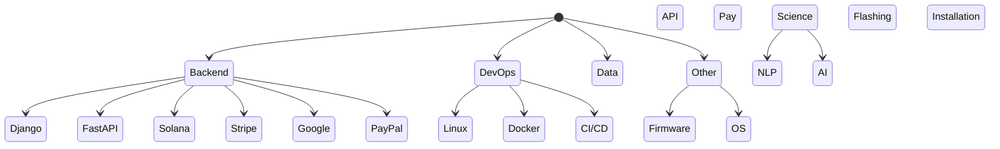
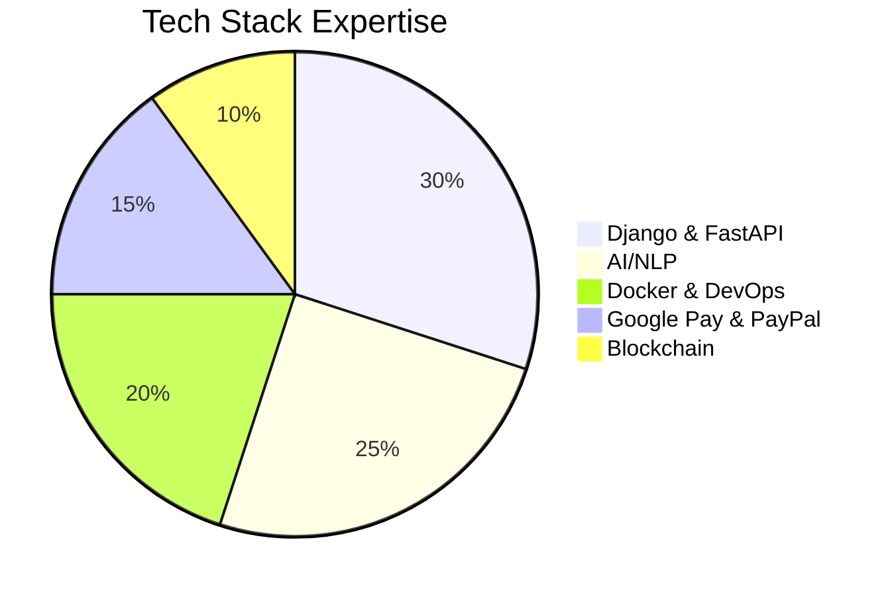

# 👋 Hello, World! 🚀

## 🧑‍💻 About Me

Hey there! I'm a **Python backend developer** with a strong focus on **Django** and **FastAPI**. But wait, there’s more! I also tinker with **Solana REST APIs**, handle **Google Pay & PayPal integrations**, and even migrate legacy **PHP applications** to Python (yes, I’m that brave). 

When I’m not battling production bugs 🐞 or optimizing SQL queries ⚡, you might find me flashing firmware on car head units 🚗 or experimenting with AI/NLP projects 🤖. I use **Linux**, but I’ve also been spotted using **macOS** when necessary. 

Oh, and if you ever need help processing Google Pay tokens in Stripe or designing subscription models with PayPal – I'm your guy. 

## 🔥 My Tech Stack & Skills

## 📊 Tech Proficiency

## 🚀 Current Interests & Projects

- Building **scalable** and **secure** backend systems 🏗️
- Developing **AI/NLP solutions** for commercial production projects 🤖  🔗
- Automating **payment workflows** with Stripe, PayPal, and Google Pay 💳
- Exploring **blockchain** for personal projects 🧠

## 📫 Let's Connect!
- 💼 [LinkedIn](https://www.linkedin.com/in/aleksander-bagdasarov/)

> "If it works, don’t touch it. If it doesn’t work, blame cache." 🤷‍♂️
